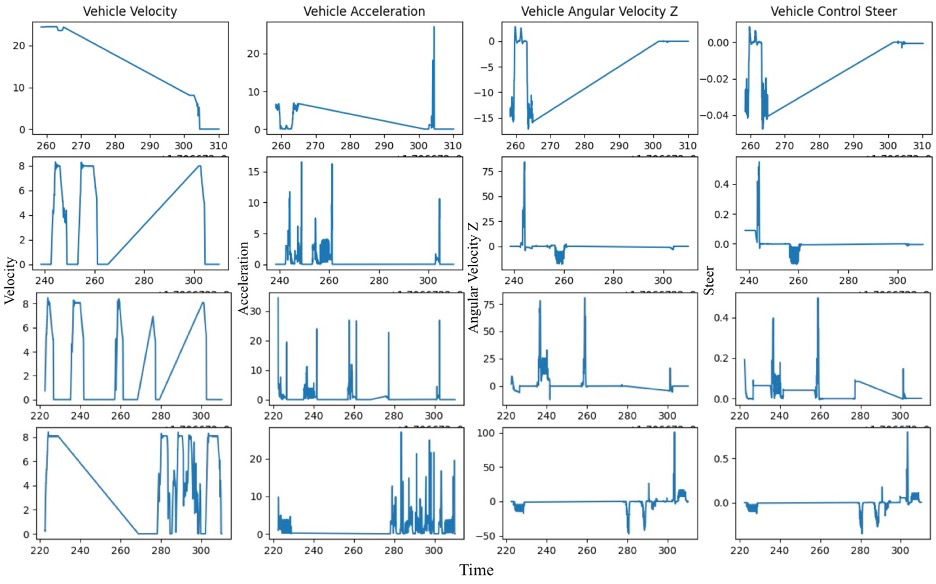

# SCI_figure
Some reusable python script for plot SCI paper figures

|  |  |
| ------------------------------------------------------------ | ------------------------------------------------------------ |
| freqence.py/plot_frequency_analysis                          | freqence.py/single_trajectories                              |
|  |  |
| ff_value.py                                                  | convert_trajectories_to_plot.py                              |
|  |  |
| line_plot.py                                                 | ff_heatmap.py                                                |

